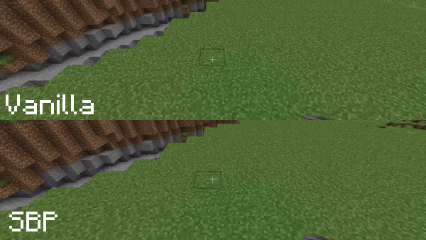

# Smart Block Placement

[Fabric API](https://modrinth.com/mod/fabric-api) is required.

>EN_US:

In vanilla Minecraft, if you hold the right mouse button on blocks you place slowly, this mod solves this problem.\
With it, you can not only quickly place blocks, but also eliminate unnecessary actions

**[WARNING]** On servers, some Anti-Cheat may complain about fast placement of blocks

>RU_RU

В ванильном Майнкрафте, если удерживать правую кнопку мыши на блоках, вы размещаете медленно, этот мод решает эту проблему.\
C помощью него вы не просто можете быстро ставить блоки, но также и устраняет лишние действия

**[ПРЕДУПРЕЖДЕНИЕ]** На серверах некоторые Анти-Чит может жаловаться за быстрое размещение блоков

