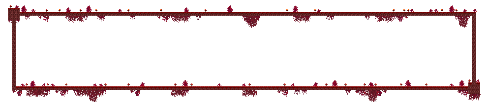
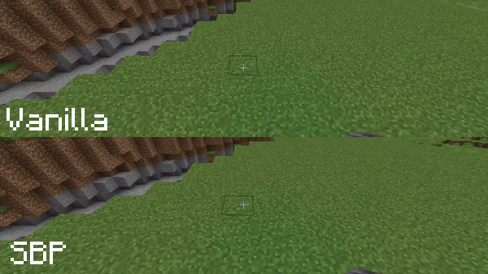

[Fabric API](https://modrinth.com/mod/fabric-api) is required.\
[Mod Menu](https://modrinth.com/mod/modmenu) and [Cloth Config API](https://modrinth.com/mod/cloth-config) are optional.

[Modrinth](https://modrinth.com/mod/smartblockplacement)
[CurseForge](https://legacy.curseforge.com/minecraft/mc-mods/smartblockplacement)

In vanilla Minecraft, holding the right mouse button to place blocks results in a slow placement speed due to animation delays. **Smart Block Placement** solves this problem.\
With this mod, you can not only place blocks rapidly but also streamline your interactions by removing unnecessary delays.

### **Key Features:**

- **Fast Building** – Place blocks as fast as you can click, bypassing the vanilla placement delay. Perfect for rapid construction and editing.
- **Creative Mode Only** – Toggle this option if you want to use the mod exclusively in Creative mode, ensuring fair play on Survival servers.
- **Customizable Usage Delay** – Control the vanilla delay for interacting with blocks and using items (levers, doors, food, etc.).

> **[WARNING]** On multiplayer servers, some Anti-Cheat plugins may flag rapid block placement or reduced usage delays as suspicious. Use with caution and respect server rules.

> **P.S.** If the mod doesn't seem to be working, please check your **Controls** settings to ensure the "Enable Smart Placement" key is bound.

